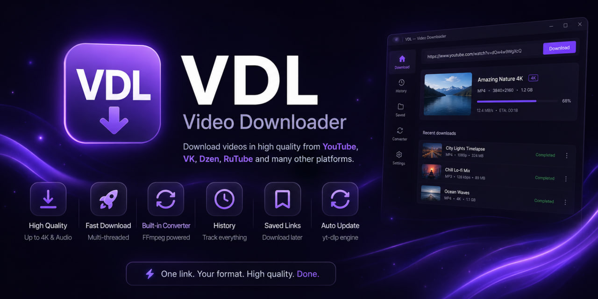

<!-- ╔══════════════════════════════════════════════════════════════╗ -->
<!--                          BANNER / БАННЕР                         -->
<!--   Замените ссылку ниже на свой баннер: assets/banner.png         -->
<!-- ╚══════════════════════════════════════════════════════════════╝ -->

<p align="center">
  
</p>

<h1 align="center">VDL — Video Downloader</h1>

<p align="center">
  
  
  
  
  
  
</p>

<p align="center">
  A desktop app for downloading videos from YouTube, VK, Dzen, RuTube and other platforms.<br>
  Десктопное приложение для скачивания видео с YouTube, VK, Dzen, RuTube и других платформ.
</p>

<p align="center">
  <a href="#english">English</a> ·
  <a href="#русский">Русский</a>
</p>

---

<a name="english"></a>

## English

A clean, dark-themed desktop video downloader. Paste a link, pick quality and format, download. Built-in converter, download history, saved links and a one-click yt-dlp updater.

### Features

- **Download** from YouTube, VK, Dzen, RuTube and more — pick resolution (up to 4K) or extract audio
- **Live progress** with a large preview card and speed / ETA
- **History** of downloads with thumbnails, format and size
- **Saved links** — bookmark videos to download later, add links right from the section
- **Converter** — convert video formats (MP4, WebM, MKV, AVI, MOV) or extract audio (MP3, AAC, FLAC, WAV, OGG) via FFmpeg
- **Smart folder handling** — if the download folder is missing, the app offers to pick a new one before starting
- **Completion sound + Windows notification** when a download finishes
- **Built-in yt-dlp updater** — sites change their protection often, update the engine in one click
- **Dark theme** with purple accents

### Tech stack

| Layer | Technology |
|-------|-----------|
| UI | Electron + React + Tailwind CSS |
| Backend | Python FastAPI (local, port 8765) |
| Download engine | yt-dlp |
| Media processing | FFmpeg |
| Storage | SQLite (SQLAlchemy) |

### Requirements

- [Node.js](https://nodejs.org/) 18+
- [Python](https://www.python.org/downloads/release/python-3129/) 3.12
- [FFmpeg](https://ffmpeg.org/download.html) (must be in PATH)

### Installation & run (development)

```bash
# 1. Clone the repository
git clone https://github.com/YOUR_USERNAME/VDL.git
cd VDL

# 2. Python environment
py -3.12 -m venv venv
venv\Scripts\activate
pip install -r requirements.txt

# 3. Node dependencies
npm install

# 4. Run
npm run dev
```

The Python backend starts automatically together with the app.

### License

Released under the [MIT License](LICENSE).

---

<a name="русский"></a>

## Русский

Аккуратный видеозагрузчик в тёмной теме. Вставьте ссылку, выберите качество и формат, скачайте. Встроенный конвертер, история загрузок, сохранённые ссылки и обновление yt-dlp в один клик.

### Возможности

- **Скачивание** с YouTube, VK, Dzen, RuTube и др. — выбор разрешения (до 4K) или извлечение аудио
- **Живой прогресс** с большим превью и скоростью / оставшимся временем
- **История** загрузок с превью, форматом и размером
- **Сохранённые ссылки** — закладки для скачивания позже, добавление ссылок прямо в разделе
- **Конвертер** — смена формата видео (MP4, WebM, MKV, AVI, MOV) или извлечение аудио (MP3, AAC, FLAC, WAV, OGG) через FFmpeg
- **Умная обработка папок** — если папка загрузок удалена, приложение предложит выбрать новую перед стартом
- **Звук + уведомление Windows** при завершении загрузки
- **Встроенное обновление yt-dlp** — сайты часто меняют защиту, обновляйте движок в один клик
- **Тёмная тема** с фиолетовыми акцентами

### Технологии

| Слой | Технология |
|------|-----------|
| Интерфейс | Electron + React + Tailwind CSS |
| Бэкенд | Python FastAPI (локально, порт 8765) |
| Движок загрузки | yt-dlp |
| Обработка медиа | FFmpeg |
| Хранилище | SQLite (SQLAlchemy) |

### Требования

- [Node.js](https://nodejs.org/) 18+
- [Python](https://www.python.org/downloads/release/python-3129/) 3.12
- [FFmpeg](https://ffmpeg.org/download.html) (должен быть в PATH)

### Установка и запуск (разработка)

```bash
# 1. Клонировать репозиторий
git clone https://github.com/ВАШ_ЛОГИН/VDL.git
cd VDL

# 2. Окружение Python
py -3.12 -m venv venv
venv\Scripts\activate
pip install -r requirements.txt

# 3. Node-зависимости
npm install

# 4. Запуск
npm run dev
```

Python-бэкенд запускается автоматически вместе с приложением.
## Authors / Авторы

- [@wonderMoronWins](https://github.com/wonderMoronWins) — author / автор
- [@urpok268](https://github.com/urpok268) — contributor / участник

### Лицензия

Распространяется под [лицензией MIT](LICENSE).

---

<p align="center">
  <sub>Made with Electron · React · Python · yt-dlp · FFmpeg</sub>
</p>
